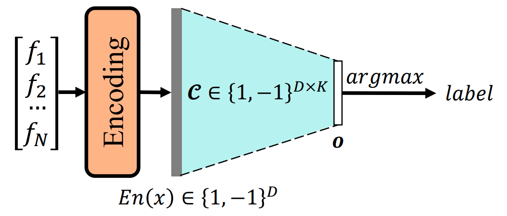
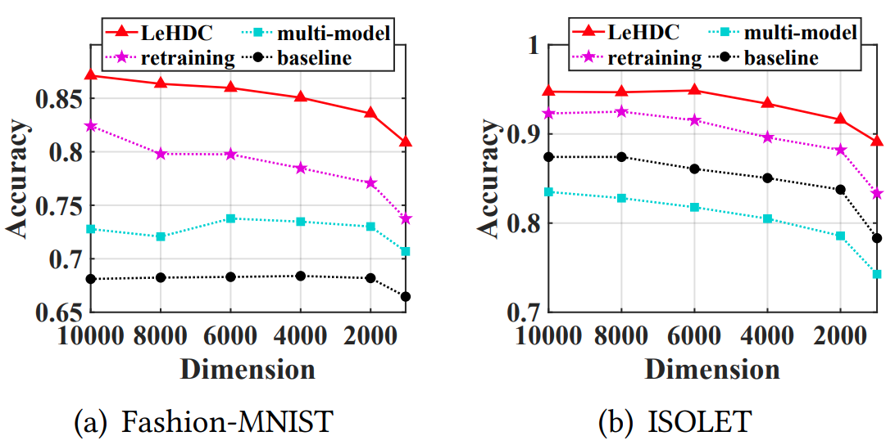

# LeHDC

This repository is a code sample for the paper [**LeHDC: Learning-Based Hyperdimensional Computing Classifier**](https://dl.acm.org/doi/abs/10.1145/3489517.3530593) appearing at Proceedings of the 59th ACM/IEEE Design Automation Conference (2022).

## :wave:Learning-based HDC

LeHDC is a binary HDC training framework that maps the existing HDC flow into an equivalent Binary Neural Network architecture.



LeHDC can outperform current HDC-related models and has good scalability along vector dimensions.



## :open_file_folder:Files

| File         | Description                                                              |
| ------------ | ------------------------------------------------------------------------ |
| /src/BNN.py  | The binary linear classifier equivalent to similarity measurement in HDC |
| /src/HDC.py  | The encoding and inference functions for HDC                             |
| /src/main.py | A simple and quick example on Fashion-MNIST on LeHDC                     |

## :star2:Papers following our training strategy!

- [TinyML'22] Shijin Duan, Xiaolin Xu, and Shaolei Ren. [**A Brain**-**Inspired Low**-**Dimensional Computing Classifier for Inference on Tiny Devices**](https://arxiv.org/abs/2203.04894); (A paper tightly following LeHDC that projects the entire HDC flow to partial BNN. :next_track_button:*It can greatly outperform SOTA HDC methods, reducing the vector dimension by 100 times (~100), but achieve comparable accuracy as LeHDC!* It's also the foundation of our ongoing work.)

- [DAC'22] Shijin Duan, Shaolei Ren, and Xiaolin Xu. [HDLock: exploiting privileged encoding to protect hyperdimensional computing models against IP stealing](https://dl.acm.org/doi/abs/10.1145/3489517.3530515);

- [TinyML'23] Yejia Liu, Shijin Duan, Xiaolin Xu, and Shaolei Ren. [MetaLDC: Meta Learning of Low-Dimensional Computing Classifiers for Fast On-Device Adaption](https://arxiv.org/abs/2302.12347);

- [INFOCOM AidTSP'23] Fangfang Yang, Shijin Duan, Xiaolin Xu, and Shaolei Ren. Achieving Certified Robustness for Brain-Inspired Low-Dimensional Computing Classifiers *(upcoming...)*

## Citation

```
@inproceedings{duan2022lehdc,
 title={LeHDC: Learning-based hyperdimensional computing classifier},
 author={Duan, Shijin and Liu, Yejia and Ren, Shaolei and Xu, Xiaolin},
 booktitle={Proceedings of the 59th ACM/IEEE Design Automation Conference},
 pages={1111--1116},
 year={2022}
}
```
